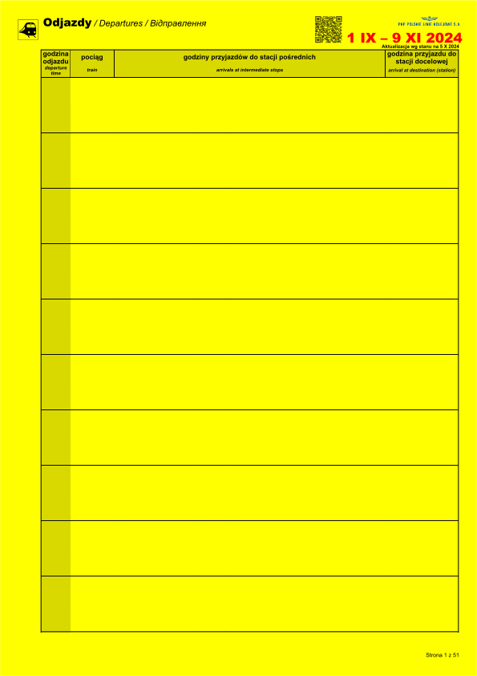
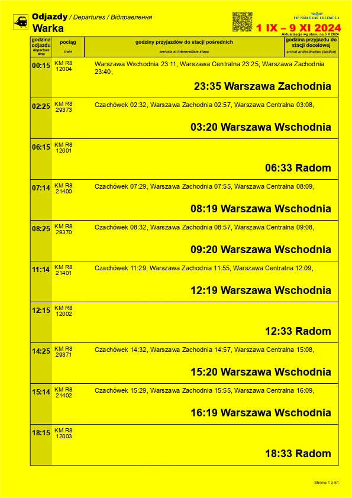

# Train Schedule Poster Generator
This script processes train schedules from an Excel file and generates posters with departure times, train details, and routes.


This branch creates fixes and reduces the size of the posters allowing for implementation drop replacing into Minecraft using Immersive paintings


## Dependencies
- Python 3.6+
- [Pillow](https://pillow.readthedocs.io/en/stable/)
- [pandas](https://pandas.pydata.org/)
- [openpyxl](https://openpyxl.readthedocs.io/en/stable/)

## Usage:
1. Install the dependencies:
```bash
pip install pillow pandas openpyxl
```
2. Place the Excel file with the train schedules in the folder with the python file
3. Run the script:
```bash
python main.py
```

## Excel file format:
The Excel file can have multiple sheets, each sheet representing a different train line. These sheets must have 'LK' in the name. 


Example:


Formating:
1. ~~Row 1 must be Empty~~ (This is no longer a requirement)
2. The first 3 rows, column 1 must be "Train Info"
3. Following rows must be train station names. Use 2 rows combined for major stations that also have arrival data
4. Column 2 signifies if the time shown in the following columns are arrival(przyj. or przj) or departure(odj.)
5. Each following column has the train name/operator in row 2 and train number in row 3
6. Each following row of the column signifies a departure time corresponding to the station in the same row
7. use "<" or "|" to signify that a train doesn't stop at a station(This is a Requirement, empty spaces will result in wrong data)
8. Use "End" on Column 1 to signify the end of the schedule               


example of a base file and a generated poster:
<div style="display: flex; justify-content: space-around;">
    
    
</div>


# If using a different base file, make sure to change the config of data locations in config.ini
