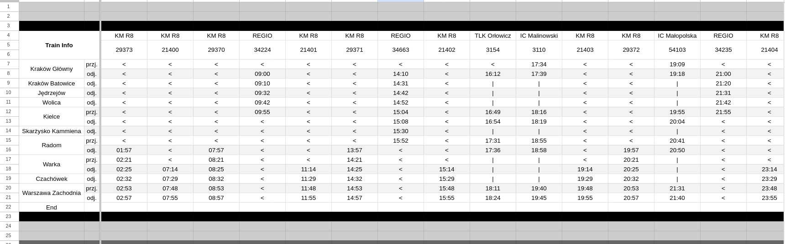

# Train Schedule Poster Generator
This script processes train schedules from an Excel file and generates posters with departure times, train details, and routes.

## Dependencies
- Python 3.6+
- [Pillow](https://pillow.readthedocs.io/en/stable/)
- [pandas](https://pandas.pydata.org/)

## Usage:
1. Install the dependencies:
```bash
pip install pillow pandas
```
2. Place the Excel file with the train schedules in the folder with the python file
3. Run the script:
```bash
python main.py
```

## Excel file format:
The Excel file can have multiple sheets, each sheets representing a different train line. 
Example:

Formating:
1. Row 1 must be Empty
2. Row 2,3,4 column 1 must be "Train Info"
3. Following rows must be train station names
4. Column 2 signifies if the time shown in the following columns are arrival(przyj. or przj) or departure(odj.)
5. Each following column has the train name/operator in row 2 and train number in row 3
6. Each following row of the column signifies a departure time coresponing to the station in the same row
7. use "<" or "|" to signify that a train doesn't stop at a station(This is a Requirement, empty spaces will result in wrong data)
                         

Name the base file for the Poster "Podstawa.png"
example of a base file:


# If using a different base file, make sure to change the config of data locations in config.ini
